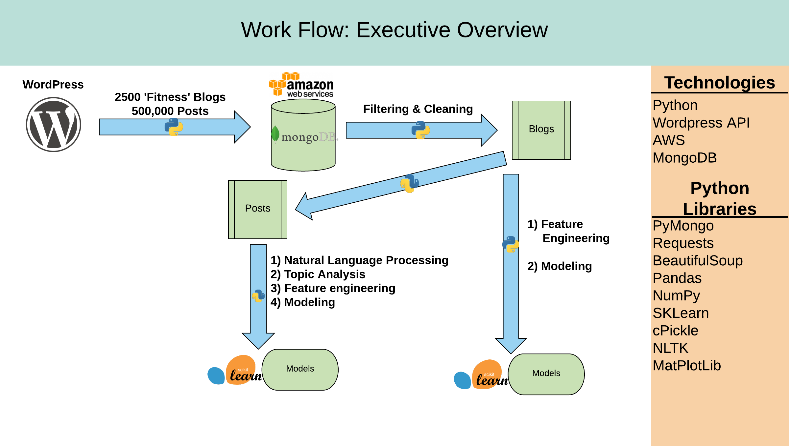
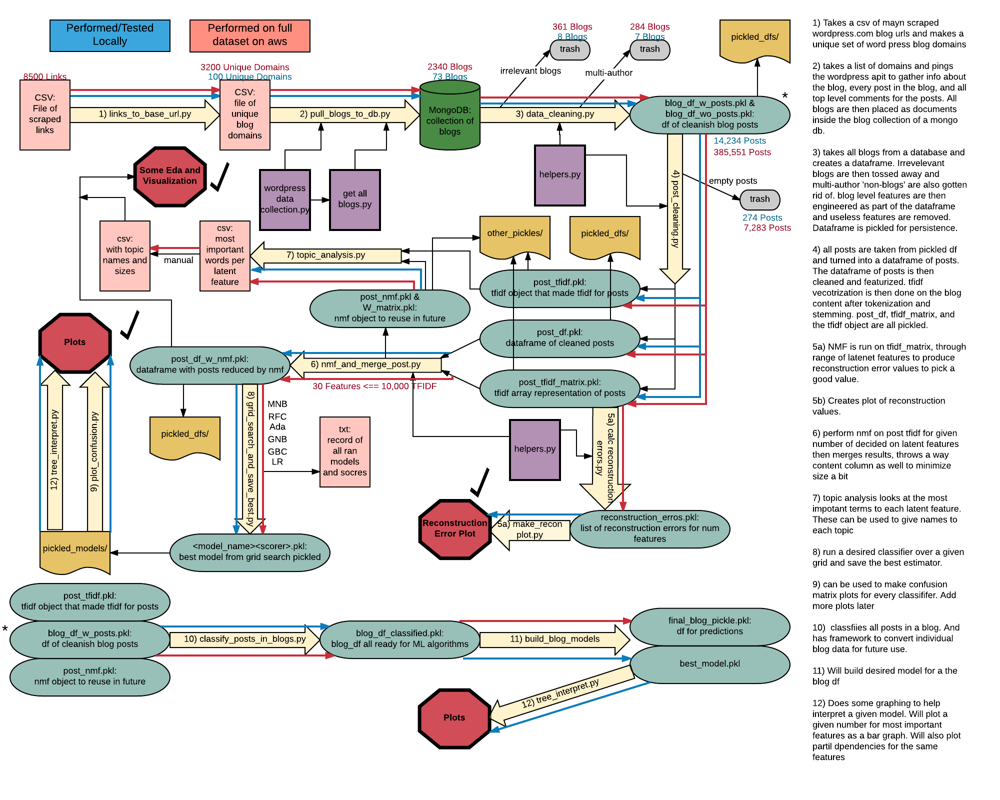

# The Successful Blogger

#### Data Science Immersive Capstone project
---

###### Project Motivation
Near the beginning of the galvanize DSI program I started a blog for myself. I
wanted a place to help promote myself as I try to transition careers. A place to
contribute my data science thoughts, and trip reports. Plus it also just seemed
like it could be fun. My fledging blog still needs lots of work, but I do have a
decent start on it.

![[screenshot of blog]](./final_images/my_blog_photo.png)

###### Is it possible to identify elements that contribute to a successful blog?
While in the DSI program I was wondering if I could use some of my new data
science skills to identify elements of a blog that can lead to its success. Of
course I would never be able to to identify everything that makes a blog do
well. It would be hard to capture the visual appeal of a blog, and it would be
almost impossible to capture aspects like self promotion. That being said I
thought it was possible to capture some aspects.

---
##### Project Overview and Workflow
To do this analysis a single topic of blogs was chosen to limit the effect of
better topics doing significantly differently. The executive overview is shown
below. The project involved gathering as many blogs as I felt like, for this I
gathered 2500 blogs. Then much cleaning and some topic filtering took place.
Then the porblem is split into two sub problems, 1 to deal with identifying
elements of successful posts, and one to identify elements of successful blogs.

All of the code to run this a analysis, or a similar analysis is contained in
the code folder of this repository. But there are quite a few steps that go into
the analysis, and the executive overview does not serve as good enough road map.
The current code some needs some reorganization, but in the meantime I will
place the current roadmap that I used will doing this project. This should serve
as a passable guide understand how the functions work together.

