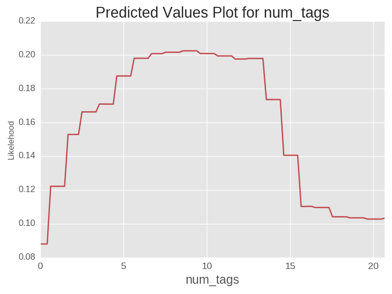

# The Successful Blogger

#### Data Science Immersive Capstone project
---

#### 5 Minute Presentation Slides
[link to slidedeck](./presentation_slides.pdf)

#### Long Version
###### Project Motivation
Near the beginning of the galvanize DSI program I started a blog for myself. I
wanted a place to help promote myself as I try to transition careers. A place to
contribute my data science thoughts, and trip reports. Plus it also just seemed
like it could be fun. My fledging blog still needs lots of work, but I do have a
decent start on it.

![[screenshot of blog]](./final_images/my_blog_photo.png)

###### Is it possible to identify elements that contribute to a successful blog?
While in the DSI program I was wondering if I could use some of my new data
science skills to identify elements of a blog that can lead to its success. Of
course I would never be able to to identify everything that makes a blog do
well. It would be hard to capture the visual appeal of a blog, and it would be
almost impossible to capture aspects like self promotion. That being said I
thought it was possible to capture some aspects.

---
##### Project Overview and Workflow
To do this analysis a single topic of blogs was chosen to limit the effect of
better topics doing significantly differently. The executive overview is shown
below. The project involved gathering as many blogs as I felt like, for this I
gathered 2500 blogs. Then much cleaning and some topic filtering took place.
Then the porblem is split into two sub problems, 1 to deal with identifying
elements of successful posts, and one to identify elements of successful blogs.

All of the code to run this a analysis, or a similar analysis is contained in
the code folder of this repository. But there are quite a few steps that go into
the analysis, and the executive overview does not serve as good enough road map.
The current code some needs some reorganization, but in the meantime I will
place the current roadmap that I used will doing this project. This should serve
as a passable guide understand how the functions work together.

##### Data Collection
Data was collected from the wordpress api, which is super friendly and easy to
use. Allows pulling of a public blogs information (most information), plus all
of blogs posts, and its comments. This can be done by knowing a blogs url to get
the unique ID. Amazingly there is no rate limiting or quota, and doesn't even
require api keys. The less robust part of the data collection currently is how
to collect the url links. I was going to scrape them from google search results,
but quickly abandoned this idea due to the massive problems of that approach.
Instead I found a fairly efficient manual method to gather about 10,000 google
search result links in about an hour using the chrome 'link clump' add on. This
deficiency is something I would like to address later given time. These 10,000
yield 2500 blogs.

##### Data storage
A blog and all of its posts were pulled into a mongo db. This was done on an ec2
instance, but with only 2500 blogs it was only about 3 Gb of data so it could
have been done locally, but just for efficiency almost all analysis stayed up on
the instance.

##### Filtering
Blogs were filtered for having multiples authors, too many post (>2500) and not
seeming relevant based on not a high enough precent of posts containing fitness
key words.

##### Splitting
From here posts are stripped out of blogs to model the things that contribute to
successful posts.

##### Natural Language Processing

Beautiful Soup was used to pull text from html, the text is cleaned, stripped,
and lemmatized. The lemmatization metod chosen was the nltk wordnet lemmatizer.
This needs to be re-examined though due to the odd words that made it through.
The tokenized documents were converted to a tfidf matrix. The resulting matrix
was then reduced with NMF, for this analysis 30 was chosen. A longer anaylsis,
or one done with more post, or no topic division could use more, as it was 30
seemed to give reasonable topics, but the reconstruction accuracy shows that it
could have easier had more topics.

##### Topic analysis
The resulting topics can be looked at by running helpers.py and giving the topic
number for example topic 5 gives the picture below.

Some of the posts that made it throuhg topic filtering were obviously not within
the realm of fitness though. For example one was very about german.

looking at the number of posts that fall into topic shows that most did fit into
the fitness topic

 
##### Machine Learning: posts
---
Lots of different models to try and predict the success of posts were done.
frame work to gridsearch to gridsearch over and then save the best model is
stored in grid_search_and_save.py. The best models were always the ensemble
models. To deal with the 'skewed' success metric (i.e. 50% of posts have zero
likes and zero comments) the continuous variable was turned into a 4 categories.
The best model was a random forest, but the adaboost and gradient boost really
were very similar. The best one has a confusion matrix below.

This is obviously far from perfect but it does identify the great traction class
fairly well. So some things can be learned from this. Individually the features
can be examined to see there individual effects, not everything is important
though. Looking at the built in feature importance shows this.

So we can ignore most of these, but lets look at the contribution of some more
interesting ones.

This is pretty nice to see trends, but It would be nice to see a few of these in
terms of the actually probability of being in a particular class, specifically
the probability of being in the most successful class. This is accomplished with
a more custom script. Lets look at the effect of changing the number of tags
since it is the most interesting.

Just by judicious use of the number of tags a post can have a 10% higher change
of making it into the most successful class of posts. Tags are blogger
designated keywords that identify the topic that a post belongs in. These are
then used in the internal topic listings for people to read posts in a certain
topic. Wordpress allows up to 20 but says if you use 'too many' then the post
will be listed less. This is to avoid users trying to abuse the topic listings
since a post can't really be in every topic. So it seems that 'too many' is
about 10. This was a nice point in the project, since the effect of this
feature is explainable. This shows that the model is most likely picking up on
real effects rather than trying to interpret noise.

###### Summary of stuff a blogger can do to be more successful in posts
* Always use 10 tags
* Write longer posts (>1000 words) (might not generalize to other topics)
* Add more images
* Add more links to other sites
* Use max number of categories
* Post whenever (no noticable difference on weekends vs weekdays)

 
#### Machine Learning: Blogs
---
Identifying successful blogs is more straight forward, just try to create a
model to predict number of subscribers. After investigating a number of options
the best one turned out to be gradient boosting regressor, although like posts
the ensemble models on a whole did about the same, and did far better than other
things such as linear regression. Before fitting models outliers were tossed out
since the median was about 25 but the max was up at 25,000 subscribers. The
overal accuracy of the model was not great, about .55 r2, and rmse of 14.
Visually this looks quite bad.

Well this is pretty bad, but lets see what can be learned anyways. First lets
look at feature importance.

Most of these make sense, if you have access to the number of likes for posts
and number of comments for posts then making a guess at the number of
subscribers doesn't seem like a far stretch. Again lets look at individual
contributions.

most of these seem pretty sensible, or might just be noise. Only thing
I found interesting was the effect of the gap between posts (but it is a minor
effect). Shown on a more interpretable scale this is seen below.

So maybe putting more thought into a post a posting less than everyday is
beneficial, hard to tell, might just be some noise. Another worth while note is
that no topic really did any better for blogs once they were assigned a main
topic.

##### Thanks For Reading
If you made it this far then thanks for reading, feel free to look at the code
or anything else in the repo

RR
